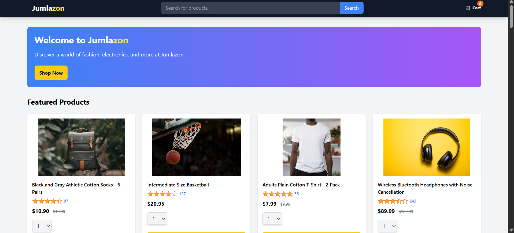
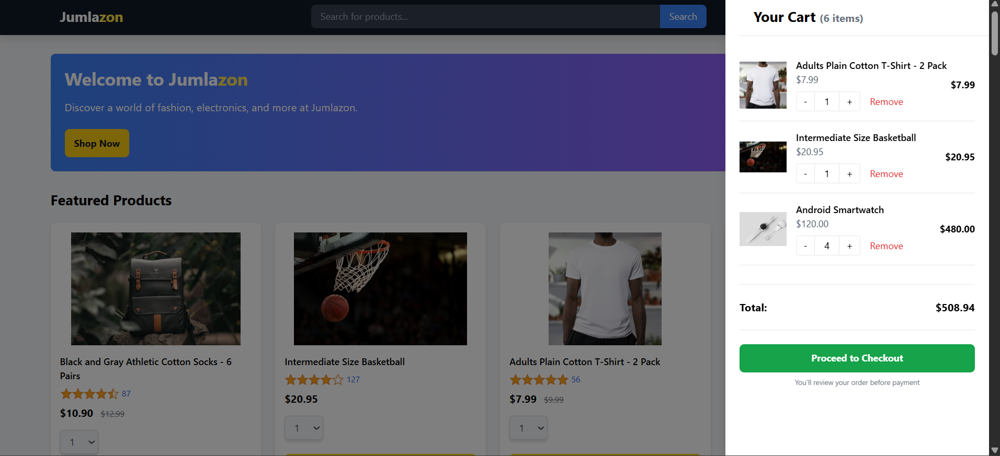
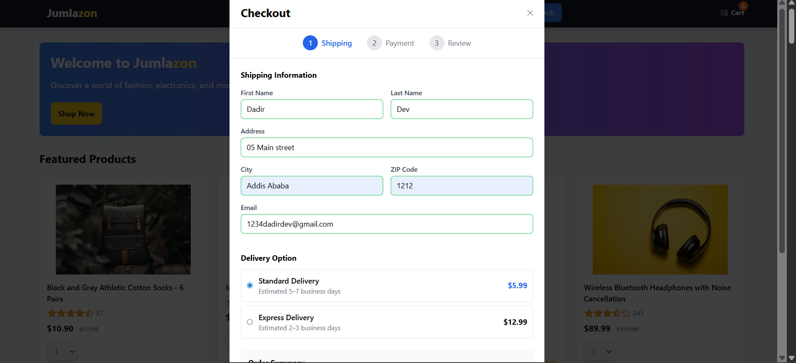

# Jumlazon 🛒

<div align="center">


**A modern, Amazon-inspired e-commerce web application built with vanilla JavaScript and Tailwind CSS.**

[Live Demo](#live-demo) • [Features](#features) • [Installation](#getting-started) • [Screenshots](#screenshots) • [Contact](#contacts)

</div>

---

## 📖 About

**Jumlazon** is a full-featured e-commerce frontend clone that mimics the core shopping experience of Amazon. Browse products, manage your cart with local persistence, and complete a multi-step checkout flow—all with a clean, responsive UI.

---

## 🚀 Live Demo

**[▶ View Live Demo](https://jumlazon-project.vercel.app)**

> Deployed on [Vercel](https://vercel.com). If the link is unavailable, run the project locally—see [Getting Started](#getting-started).

---

## ✨ Features

- **Product Catalog** — Browse featured products with images, ratings, and pricing
- **Shopping Cart** — Add, remove, and update quantities with real-time totals
- **Local Storage Persistence** — Cart and checkout data survive page refreshes
- **Multi-Step Checkout** — Shipping info, delivery options, payment method, and order review
- **Delivery Options** — Standard and Express shipping with dynamic pricing
- **Responsive Design** — Mobile-friendly layout with hamburger menu and collapsible search
- **Unit & Integration Tests** — Jest-powered test suite for cart and checkout logic

---

## 🛠 Tech Stack

| Category       | Technology                             |
| -------------- | -------------------------------------- |
| **Frontend**   | HTML5, Vanilla JavaScript (ES Modules) |
| **Styling**    | Tailwind CSS 3.4                       |
| **Testing**    | Jest + jsdom                           |
| **Build**      | Tailwind CLI                           |
| **Deployment** | Vercel                                 |

---

## 📁 Project Structure

```
jumlazon-project/
├── data/
│   ├── cartData.js        # Cart state
│   ├── products.js        # Product catalog
│   └── backend-practice.js
├── scripts/
│   ├── jumlazon.js        # Main app entry & event wiring
│   ├── cart.js            # Cart logic (add, remove, update)
│   ├── cartUI.js          # Cart rendering
│   ├── products.js        # Product grid rendering
│   ├── checkout.js        # Checkout flow (shipping, payment, review)
│   └── delivery-options.js
├── src/
│   └── input.css          # Tailwind source
├── styles/
│   └── jumlazon.css       # Compiled CSS
├── tests/
│   └── script/            # Unit & integration tests
├── index.html
├── package.json
├── tailwind.config.js
└── vercel.json            # Vercel deployment config
```

---

## 🏁 Getting Started

### Prerequisites

- **Node.js** 18+ and npm

### Installation

1. **Clone the repository**

   ```bash
   git clone https://github.com/Dadir-Dev/jumlazon-project.git
   cd jumlazon-project
   ```

2. **Install dependencies**

   ```bash
   npm install
   ```

3. **Build Tailwind CSS**

   ```bash
   npm run build
   ```

4. **Open in browser**
   - Use a local server (e.g. [Live Server](https://marketplace.visualstudio.com/items?itemName=ritwickdey.LiveServer) in VS Code), or
   - Open `index.html` directly (some features may vary with `file://` protocol)

### Available Scripts

| Command         | Description          |
| --------------- | -------------------- |
| `npm run build` | Compile Tailwind CSS |
| `npm test`      | Run Jest tests       |

---

## 🧪 Testing

```bash
npm test
```

Tests cover:

- Cart logic: `addToCart`, `removeFromCart`, `updateQuantity`, totals
- Pure functions for immutability and testability
- Integration flows with cart and checkout

---

## 📸 Screenshots

|              Homepage               |              Cart               |                Checkout                 |
| :---------------------------------: | :-----------------------------: | :-------------------------------------: |
|  |  |  |

---

## 📄 License

This project is licensed under the **ISC License**.

---

## 🙏 Acknowledgements

- [Tailwind CSS](https://tailwindcss.com) — Utility-first CSS framework
- [Jest](https://jestjs.io) — JavaScript testing framework
- [Unsplash](https://unsplash.com) — Product images
- [Day.js](https://day.js.org) — Date utilities in checkout
- [Vercel](https://vercel.com) — Hosting and deployment

---

## 📬 Contacts

| Channel                                                                   | Link                                                                             |
| ------------------------------------------------------------------------- | -------------------------------------------------------------------------------- |
| **GitHub**                                                                | [@Dadir-Dev](https://github.com/Dadir-Dev)                                       |
| **LinkedIn**                                                              | [@Abdikadir Mohammed](https://www.linkedin.com/in/abdikadir-mohammed-54717318b/) |
| **Issues**                                                                | [Report a bug](https://github.com/Dadir-Dev/jumlazon-project/issues)             |
|  | [jumlazon-project](https://github.com/Dadir-Dev/jumlazon-project)                |

---

<div align="center">

**Built with ❤️ by Dadir**

</div>
